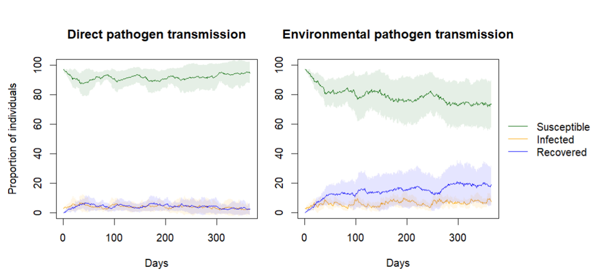

# MasTSim – Mastitis Transmission Simulator

A computational tool to simulate direct and environmental transmission of mastitis-causing bacteria in dairy cows. The computational tool simulates the transmission of pathogens using realistic social interaction and area utilisation information of dairy cows.

## Content

Core methods to analyse social contact data:

-   `scripts/Direct_transmission.R`: This tutorial simulates a direct transmission of mastitis-causing bacteria within a dairy farm following the prevalence of mastitis infection reported in [Woudstra et al. (2023). Strain diversity and infection durations of Staphylococcus spp. and Streptococcus spp. causing intramammary infections in dairy cows](https://doi.org/10.3168/JDS.2022-22942) and the social network structure reported in [Marina et al. (2023). New insight into social relationships in dairy cows and how time of birth, parity, and relatedness affect spatial interactions later in life](https://doi.org/10.3168/JDS.2023-23483) 

-   `scripts/Enviromental_transmission.R`: This tutorial simulates an environmental transmission of mastitis-causing bacteria within a dairy farm following the prevalence of mastitis infection reported in [Woudstra et al. (2023) Reservoirs of Staphylococcus spp. and Streptococcus spp. Associated with Intramammary Infections of Dairy Cows](https://doi.org/10.3390/PATHOGENS12050699) and the area utilisation distribution reported in [Marina et al. (2024). Multiple factors shape social contacts in dairy cows](https://doi.org/10.1016/J.APPLANIM.2024.106366) 

## Outputs

The results show the average prevalence of susceptible (healthy), infected and, recovered animals over a simulated year. The shaded lines show the standard deviation of the simulated replicates:

## Participants in the CSI:DT project

-   Lars Rönnegård (DU & SLU): Principal investigator.
-   Per Peetz Nielsen (RISE)
-   Carsten Kirkeby (KU)
-   Volker Krömker (KU)
-   Freddy Fikse (Växa Sverige)
-   Anna Skarin (SLU)
-   Moudud Alam (DU)
-   Keni Ren (SLU)
-   Maya Katrin Gussmann (KU)
-   Svenja Woudstra (KU)
-   Ida Hansson (SLU)
-   Hector Marina (SLU)

## Contributing

Pull requests are welcome. Please make sure to update tests as appropriate.

## License

[SLU](https://www.slu.se/)
